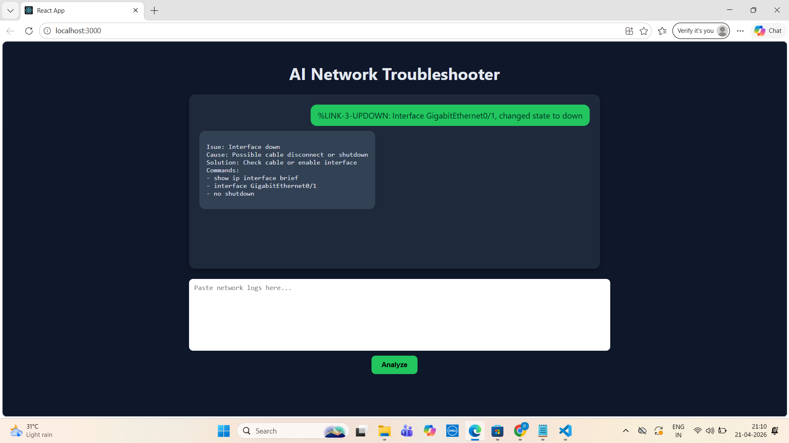

# 🚀 AI Network Troubleshooting Assistant  
### 🧠 Smart NOC Tool powered by Generative AI


---

## 🔍 Overview

A **Full Stack + AI-powered application** that analyzes real-world network logs and provides intelligent troubleshooting insights—just like a Network Engineer.

This project combines:
👉 **CCNA Networking Knowledge + Java Spring Boot + ReactJS + Generative AI**

---

## 💡 Problem Statement

Network engineers spend significant time analyzing logs manually.

🔴 This tool automates:
- Log analysis  
- Root cause detection  
- Suggested fixes  

---

## ✨ Features

✅ Analyze raw network logs  
✅ Identify:
- Issue  
- Cause  
- Solution  
- Commands  

✅ Chat-style UI (like ChatGPT)  
✅ Typing animation for responses  
✅ Fallback handling for API failures  
✅ Clean and responsive interface  

---

## 📸 Demo

### 💬 Chat UI


---

## 🛠 Tech Stack

### 🔹 Frontend
- ReactJS  
- Axios  
- CSS (Custom UI)

### 🔹 Backend
- Java  
- Spring Boot  
- REST APIs  

### 🔹 AI Integration
- OpenAI API  
- WebClient  

---

## ⚙️ Setup Instructions

### 🔧 Backend

```bash
cd ai-network-backend/network-ai
./mvnw spring-boot:run
